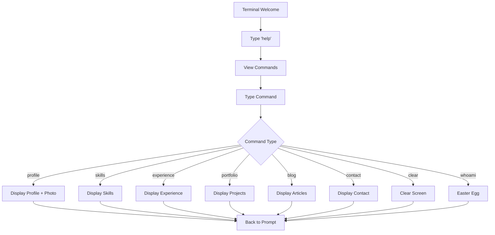

## 1. Product Overview

Website personal dengan desain Terminal/CLI retro yang memungkinkan pengunjung menavigasi menggunakan perintah teks. Menampilkan profil, keterampilan, pengalaman, dan portfolio Adi sebagai Web Programmer dengan nuansa hacker yang misterius.

Target pengguna: Security Researcher, Linux Enthusiast, System Admin yang menyukai antarmuka terminal klasik.

## 2. Core Features

### 2.1 User Roles

| Role    | Registration Method      | Core Permissions                               |
| ------- | ------------------------ | ---------------------------------------------- |
| Visitor | No registration required | Can type commands to navigate and view content |

### 2.2 Feature Module

Website personal ini terdiri dari halaman utama dengan sistem navigasi berbasis perintah:

1. **Terminal Interface**: Layar hitam dengan prompt command, input teks, dan output terminal
2. **Profile Section**: Informasi pribadi, foto, dan deskripsi singkat
3. **Skills Display**: Progress bar dan persentase keterampilan teknis
4. **Experience Timeline**: Riwayat pekerjaan dan pengalaman profesional
5. **Portfolio Gallery**: Daftar proyek dan tools yang telah dibuat
6. **Blog Articles**: Tulisan tutorial dan artikel teknis
7. **Contact Information**: Informasi kontak dan lokasi

### 2.3 Page Details

| Page Name           | Module Name       | Feature description                                                                                     |
| ------------------- | ----------------- | ------------------------------------------------------------------------------------------------------- |
| Terminal Interface  | Command Input     | Accept text commands from visitor with blinking cursor and command history.                             |
| Terminal Interface  | Command Processor | Parse and execute commands: help, profile, skills, experience, portfolio, blog, contact, clear, whoami. |
| Terminal Interface  | Output Display    | Show command results in monospace font with ASCII art and colored text.                                 |
| Terminal Interface  | Photo Display     | Render uploaded image with ASCII border decoration when profile command executed.                       |
| Profile Section     | Personal Info     | Display name, title, and description with typing animation effect.                                      |
| Skills Display      | Technical Skills  | Show progress bars for Laravel, MySQL, Cloud Computing, Mikrotik, Ruijie Network.                       |
| Experience Timeline | Work History      | List previous employment with date ranges and job descriptions.                                         |
| Portfolio Gallery   | Projects List     | Display web tools and websites with brief descriptions.                                                 |
| Blog Articles       | Tutorial List     | Show article titles with publication dates.                                                             |
| Contact Information | Contact Details   | Display address, phone, email, and website with copy-to-clipboard functionality.                        |

## 3. Core Process

### Visitor Flow:

1. Visitor lands on website and sees terminal welcome message with ASCII art
2. Visitor types 'help' to see available commands
3. Visitor navigates by typing commands like 'profile', 'skills', 'experience'
4. Each command displays relevant information in terminal format
5. Visitor can use 'clear' to reset screen or 'whoami' for easter egg

## 4. User Interface Design

### 4.1 Design Style

* **Primary Color**: #00FF00 (hijau terminal klasik)

* **Secondary Color**: #FF0000 (merah untuk error), #FFFF00 (kuning untuk peringatan)

* **Background**: #000000 (hitam pekat)

* **Font**: 'Courier New', monospace, 14px

* **Button Style**: Tidak ada tombol, semua interaksi via keyboard

* **Layout**: Full-screen terminal dengan padding 20px

* **ASCII Art**: Border dan dekorasi menggunakan karakter ASCII

* **Animation**: Typing effect untuk output teks, blinking cursor

### 4.2 Page Design Overview

| Page Name           | Module Name    | UI Elements                                                                                                                            |
| ------------------- | -------------- | -------------------------------------------------------------------------------------------------------------------------------------- |
| Terminal Interface  | Main Screen    | Black background (#000000), green text (#00FF00), monospace font 14px, command prompt 'visitor\@adi:\~$ ', blinking underscore cursor. |
| Terminal Interface  | Command Output | White text (#FFFFFF) for content, green for success, red for errors, yellow for warnings, ASCII borders using '+' and '-' characters.  |
| Profile Display     | Photo Section  | ASCII frame around uploaded image, positioned center-top with typing animation for accompanying text.                                  |
| Skills Display      | Progress Bars  | Colored progress bars using Unicode blocks: █ (filled) and ░ (empty), percentage in brackets.                                          |
| Experience Timeline | Job Entries    | Date ranges in \[YYYY-MM-DD] format, company names in uppercase, descriptions with proper indentation.                                 |

### 4.3 Responsiveness

Desktop-first design dengan mobile-adaptive layout. Terminal tetap proporsional di layar kecil dengan font size yang menyesuaikan. Touch interaction dioptimasi dengan virtual keyboard support.
