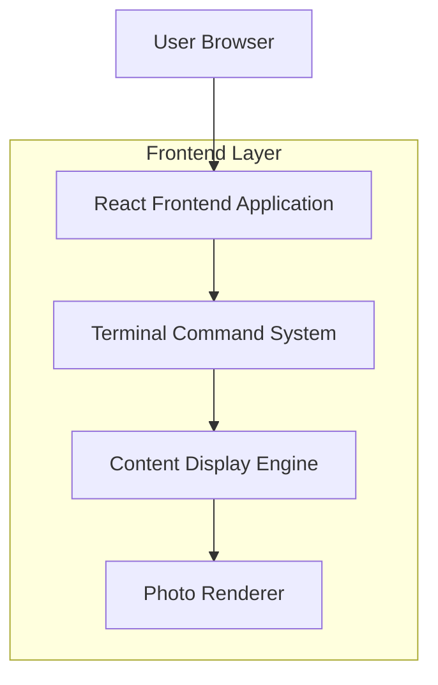
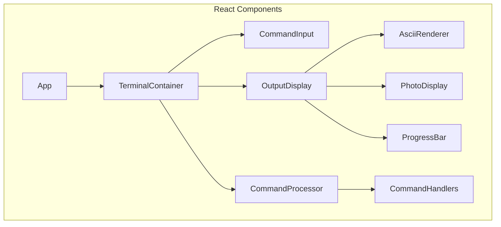

## 1. Architecture design



## 2. Technology Description
- Frontend: React@18 + tailwindcss@3 + vite
- Initialization Tool: vite-init
- Backend: None (Static React Application)

## 3. Route definitions
| Route | Purpose |
|-------|---------|
| / | Terminal interface utama dengan command prompt |
| /terminal | Alias untuk halaman utama terminal |

## 4. Core Components

### 4.1 Terminal Component
```typescript
interface TerminalState {
  history: string[];
  currentLine: string;
  cursorPosition: number;
  output: TerminalOutput[];
}

interface TerminalOutput {
  type: 'command' | 'response' | 'error' | 'system';
  content: string;
  timestamp: Date;
}
```

### 4.2 Command System
```typescript
interface Command {
  name: string;
  description: string;
  handler: (args: string[]) => TerminalOutput[];
  aliases?: string[];
}

const availableCommands: Command[] = [
  { name: 'help', description: 'Show available commands', handler: helpHandler },
  { name: 'profile', description: 'Display personal profile', handler: profileHandler },
  { name: 'skills', description: 'Show technical skills', handler: skillsHandler },
  { name: 'experience', description: 'Display work experience', handler: experienceHandler },
  { name: 'portfolio', description: 'Show projects and tools', handler: portfolioHandler },
  { name: 'blog', description: 'Display blog articles', handler: blogHandler },
  { name: 'contact', description: 'Show contact information', handler: contactHandler },
  { name: 'clear', description: 'Clear terminal screen', handler: clearHandler },
  { name: 'whoami', description: 'Easter egg command', handler: whoamiHandler }
];
```

### 4.3 Data Structures
```typescript
interface ProfileData {
  name: string;
  title: string;
  description: string;
  photo: string; // path to uploaded image
}

interface Skill {
  name: string;
  percentage: number;
  category: 'framework' | 'database' | 'cloud' | 'networking';
}

interface Experience {
  company: string;
  position: string;
  startDate: string;
  endDate: string;
  description: string[];
}

interface Project {
  name: string;
  description: string;
  url?: string;
  category: 'tool' | 'website' | 'script';
}

interface Article {
  title: string;
  date: string;
  category: string;
}

interface Contact {
  address: string;
  phone: string;
  email: string;
  website: string;
}
```

## 5. Component Architecture



## 6. Styling System

### 6.1 CSS Variables
```css
:root {
  --terminal-bg: #000000;
  --terminal-text: #00FF00;
  --terminal-error: #FF0000;
  --terminal-warning: #FFFF00;
  --terminal-system: #0080FF;
  --font-mono: 'Courier New', monospace;
  --font-size: 14px;
  --line-height: 1.4;
}
```

### 6.2 Terminal Effects
```css
.blinking-cursor {
  animation: blink 1s infinite;
}

@keyframes blink {
  0%, 50% { opacity: 1; }
  51%, 100% { opacity: 0; }
}

.typing-effect {
  overflow: hidden;
  border-right: 2px solid var(--terminal-text);
  white-space: nowrap;
  animation: typing 3s steps(40, end), blink-caret 0.75s step-end infinite;
}
```

## 7. Command Processing Logic

### 7.1 Input Handler
```typescript
const handleCommandInput = (input: string): TerminalOutput[] => {
  const [commandName, ...args] = input.trim().split(' ');
  const command = availableCommands.find(cmd => 
    cmd.name === commandName || cmd.aliases?.includes(commandName)
  );
  
  if (!command) {
    return [{
      type: 'error',
      content: `Command not found: ${commandName}. Type 'help' for available commands.`,
      timestamp: new Date()
    }];
  }
  
  return command.handler(args);
};
```

### 7.2 ASCII Art Generator
```typescript
const generateAsciiBorder = (width: number, height: number): string => {
  const top = '+' + '-'.repeat(width - 2) + '+';
  const middle = '|' + ' '.repeat(width - 2) + '|';
  const bottom = '+' + '-'.repeat(width - 2) + '+';
  
  return [top, ...Array(height - 2).fill(middle), bottom].join('\n');
};
```

## 8. Photo Integration

### 8.1 Image Processing
```typescript
const processUploadedImage = (imagePath: string): ProcessedImage => {
  return {
    path: imagePath,
    asciiFrame: generateAsciiBorder(50, 20),
    displayWidth: 400,
    displayHeight: 300
  };
};
```

### 8.2 Display Format
```typescript
const displayProfileWithPhoto = (profile: ProfileData): TerminalOutput[] => {
  return [
    {
      type: 'system',
      content: generateAsciiBorder(60, 25),
      timestamp: new Date()
    },
    {
      type: 'response',
      content: `Name: ${profile.name}\nTitle: ${profile.title}\n\n${profile.description}`,
      timestamp: new Date()
    }
  ];
};
```